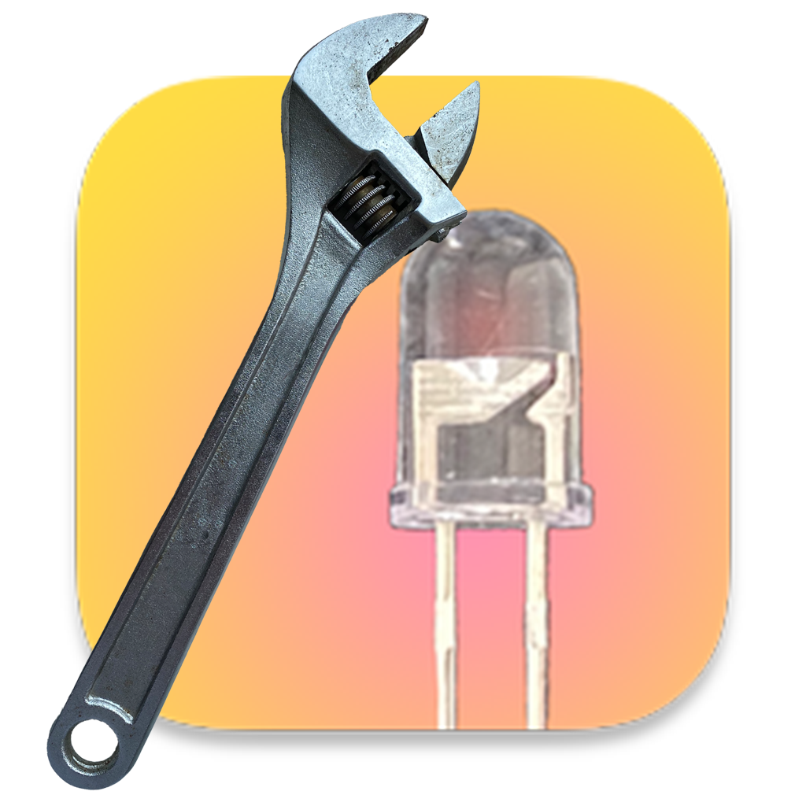
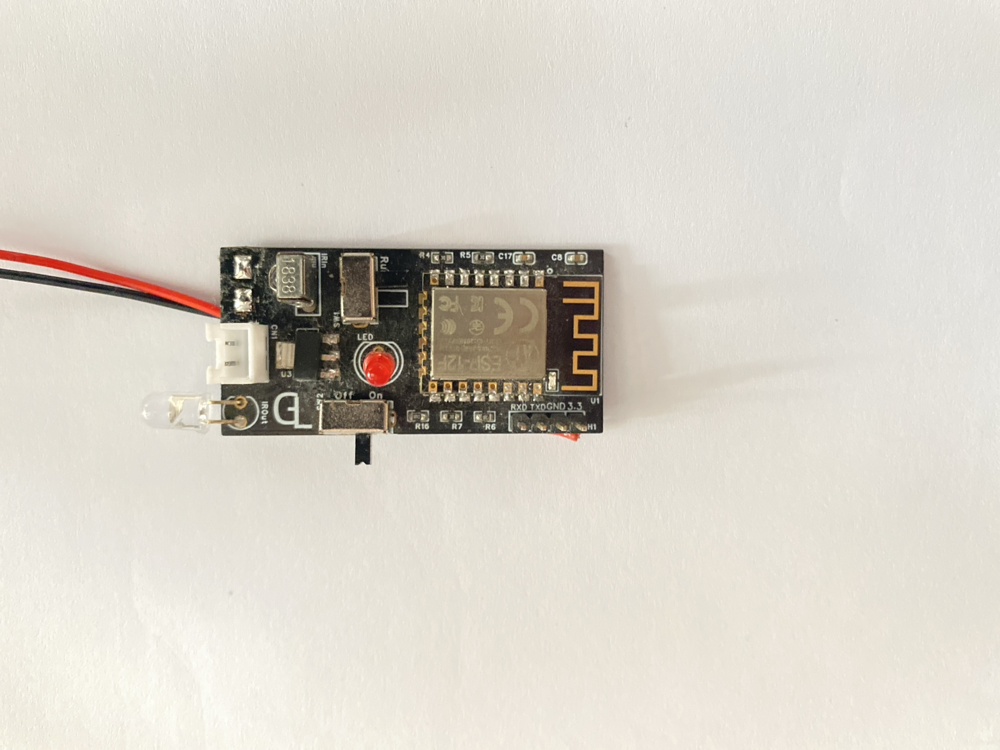

  
  <h1>Wi-Fi_IR Remote Controler</h1>
  
Using an infrared remote control via Wi-Fi. Connect old devices to the internet.

  <a href='./docs/cn_zh.md'>简体中文</a>

## Introduction

This project is designed to integrate legacy devices into the Internet of Things (IoT), enabling Wi-Fi access and control.

> Additionally, this project also functions as an infrared development device. It can receive infrared signals for debugging purposes.

### Technologies/Hardware Used

The hardware component is implemented using the ESP12F (based on ESP8266). The control software is written in Swift and can run on macOS, iOS, and iPadOS. This is a web-based control project, allowing you to easily develop your own control interfaces.

## Usage

### Hardware Section

#### Preparation

##### Soldering and Flashing

Solder the ESP12F onto the PCB, connect to the chip using a microcontroller communication tool, and flash the firmware.

##### Power On

Power on the flashed chip. The indicator light will stay solid during initialization and switch to blinking once completed.

*(Refer to **Indicator Status** for explanations.)*

#### Initial Setup

##### Connecting to Wi-Fi

1. Turn on an internet-capable device and connect to the Wi-Fi with SSID `Gl Device Connect`. The device will automatically open the provisioning page.

   > Note: If the page doesn’t open automatically, visit: `http://192.168.4.1`.

2. Select your Wi-Fi network, enter the password, click "Connect," and the device will reboot.

##### Connection

After rebooting, if initialization is successful and Wi-Fi is connected, the indicator will briefly blink and then stay solid, indicating success. If it continues blinking, the connection failed—repeat the *Connecting to Wi-Fi* steps.

##### Placement

Position the device so that the infrared LED faces the target device or its signal can reflect onto it.

#### Usage

##### Controlling the Device via App

*(Refer to the **Software** section.)*

##### Controlling the Device via HTTP (API)

###### Sending Infrared Commands

Request: `http://ip/IRControl`

Parameters:

| Parameter | Format       | Method | Required |
| :-------- | :----------- | :----- | :------- |
| IRSign    | String (Hex) | GET    | Yes      |

Response:

| Return Value       | Meaning        |
| :----------------- | :------------- |
| Success            | Command sent   |
| Null / No response | Failed to send |

###### Receiving Infrared Commands

Request (GET): `http://ip/IRReSend`

| Return Value | Meaning       |
| :----------- | :------------ |
| String (Hex) | Infrared data |
| Null         | No data       |

Note: Poll this endpoint (recommended interval: 0.1s).

#### Additional Notes

##### Indicator Status

| Indicator State | Meaning                                                      |
| :-------------- | :----------------------------------------------------------- |
| Solid           | 1. During power-on: Initializing and attempting to connect to the last-used Wi-Fi. 2. After rapid blinking: Connected to Wi-Fi, ready for commands. |
| Rapid Blinking  | Connected to Wi-Fi.                                          |
| Blinking        | Awaiting Wi-Fi connection *(see **Initial Setup**)*.         |

### Software

Follow the on-screen instructions for usage.

> Note: This software is only intended for API demonstration and device debugging, not for production use.