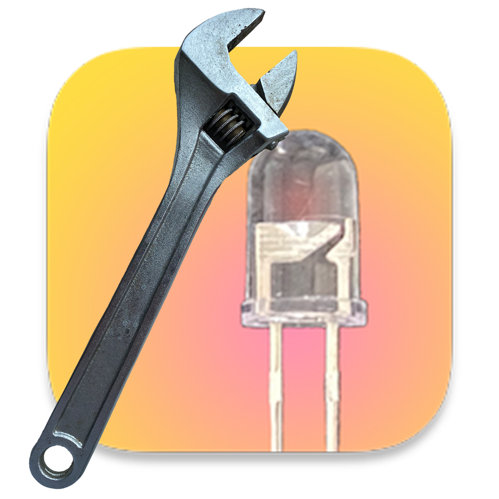

  
  <h1>Wi-Fi_红外遥控器</h1>
  
通过Wi-Fi使用红外遥控器。让老设备连接物联网。

## 简介

本项目用于将一些老设备添加到物联网，以便通过Wi-Fi访问并控制这些设备。

> 此外，本项目也是一个红外开发设备。该项目可以接收红外信号，以便用于红外调试

> 欢迎提交Issue和PR，共同改进项目。

### 所用技术/硬件

本项目硬件部分使用ESP12F（基于ESP8266）实现。控制软件使用Swift编写并可以运行在macOS、iOS、iPadOS上。这是一个基于Web控制的项目，你可以轻而易举地开发自己的控制设备。

## 使用

### 硬件部分

#### 准备

##### 焊接与烧录

将 ESP12F 焊接到 PCB 上，使用单片机通信软件连接芯片，刷写固件。

##### 上电

将烧录的芯片上电，此时指示灯常亮，待初始化完成后，指示灯转为闪烁。

（指示灯状态解释请参见*指示灯状态* ）

#### 初始化设置

##### 连接 Wi-Fi

1. 打开可联网设备，连接 SSID 为`Gl Device Connect`的 Wi-Fi，设备将自动打开配网页面。

> 注意：若设备未自动打开，请访问：`http://192.168.4.1`

2. 选择您的 Wi-Fi，并输入密码，点击“连接”，随后设备将重启。

##### 连接

重启后， 若设备初始化完毕并成功连接 Wi-Fi， 指示灯将由常亮短暂闪烁后再次常亮，即连接成功。若依然闪烁，则连接失败，请转到*连接Wi-Fi*。

##### 放置

请将本设备放置到所需位置，使红外发光二极管正对或红外光可反射到被控制设备。

#### 使用

##### 使用 App 控制设备

（ 该部分请参见 *软件* 部分 ）

##### 使用 HTTP 控制设备（API）

######  发送红外指令

请求：`http://ip/IRControl`

参数：

|  参数  |    格式     | 方法 | 必须 |
| :----: | :---------: | :--: | :--: |
| IRSign | String(Hex) | GET  |  是  |

返回：

|       返回值       |   含义   |
| :----------------: | :------: |
|      Success       | 发送成功 |
| 空（Null）或未响应 | 发送失败 |

###### 接受红外指令

请求(GET):`http://ip/IRReSend`

|   返回值    |   含义   |
| :---------: | :------: |
| String(Hex) | 红外数据 |
| 空（Null）  | 没有数据 |

注意：需监听此地址，建议间隔0.1秒。

#### 其他

##### 指示灯状态

| 指示灯状态 |                             含义                             |
| :--------: | :----------------------------------------------------------: |
|    常亮    | 1、若在通电后：正在初始化 并尝试连接上次连接的 Wi-Fi。 2、若在快速闪烁后：已连接 到 Wi-Fi，准备接收指令。 |
|  快速闪烁  |                        已连接到 Wi-Fi                        |
|    闪烁    |          等待连接 Wi-Fi （ 参见*初始化设置* ）           |

### 软件

根据相关提示使用即可。

> 注意：本软件仅被开发用于API调用的演示及设备调试，不应该用为正式生产使用。